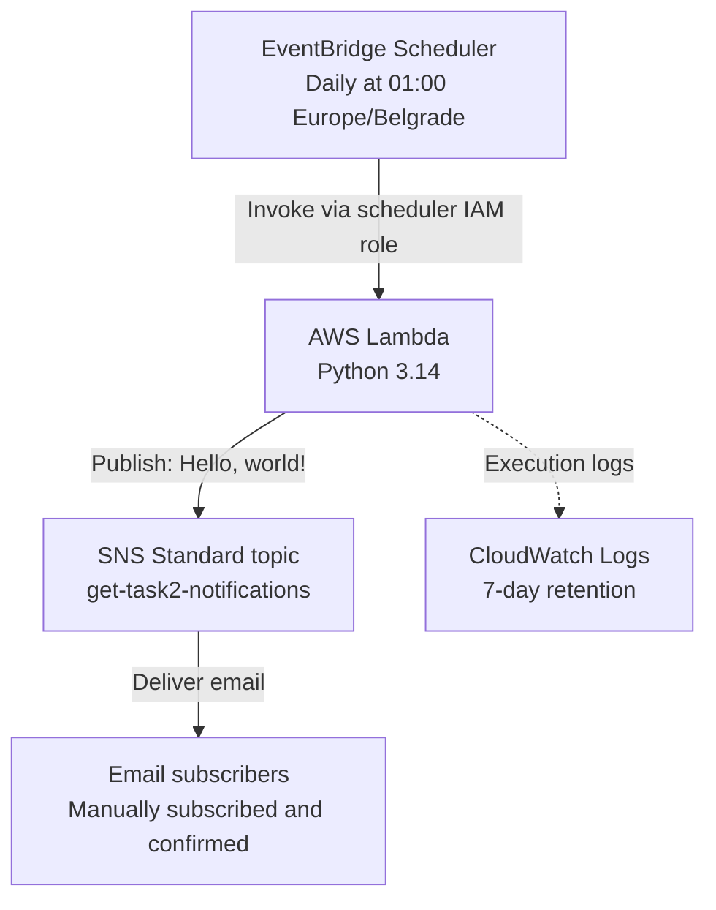

# GET DevOps Task 2

Python Lambda publishes the exact message `Hello, world!` to an SNS Standard topic. EventBridge Scheduler invokes it daily at **01:00 Europe/Belgrade**. Email subscribers are added and confirmed manually, as required by the assignment.

## Architecture



AWS handles scheduling, execution, permissions, retries and email delivery. The function only publishes a message and logs the resulting SNS MessageId. It runs outside a VPC and uses its IAM role for authentication.

## Project layout

| Path | Purpose |
| --- | --- |
| `src/handler.py` | Lambda handler |
| `terraform/` | Lambda, SNS, Scheduler, IAM, logs and mock tests |
| `tests/` | Python/SNS API boundary and packaging tests |
| `scripts/build.py` | Lambda ZIP with hash-locked dependencies |
| `scripts/package.py` | Source-only submission ZIP |
| `docs/DEMO_SR.md` | Serbian demo walkthrough |

## Deploy

Requires Terraform >=1.7 and <2, Python 3.14, AWS CLI v2, Make and [uv](https://docs.astral.sh/uv/). Run commands from the repository root. Use an authorized AWS profile; credentials are not stored in the project.

```bash
export AWS_PROFILE=your-profile
export AWS_REGION=eu-central-1
aws sts get-caller-identity
cp terraform/terraform.tfvars.example terraform/terraform.tfvars
# Set account_id to the intended AWS account.
make build
make init
make check
terraform -chdir=terraform plan -out=task2.tfplan
terraform -chdir=terraform apply task2.tfplan
terraform -chdir=terraform output
```

`make build` packages Boto3 and all transitive dependencies from `requirements.txt`; it does not rely on the runtime's bundled SDK. The provider version is locked in `terraform/.terraform.lock.hcl`. Local configuration, Terraform state, build artifacts and evidence are ignored by Git and excluded from the submission ZIP. Preserve local state for future updates and teardown.

## Manual email subscription

1. Open SNS in the deployment region and select `get-task2-notifications`.
2. Choose **Create subscription**, protocol **Email**, and enter the recipient's address.
3. Open the Amazon SNS confirmation email and click **Confirm subscription**.
4. Verify the subscription is confirmed, rather than `PendingConfirmation`.

Neither Terraform nor the Lambda code creates email subscriptions. Email endpoints require a Standard topic. SNS adds its standard email footer; the published message itself is exactly `Hello, world!`. [AWS email subscription guide](https://docs.aws.amazon.com/sns/latest/dg/sns-email-notifications.html)

## Schedule and permissions

- Schedule: `cron(0 1 * * ? *)`, time zone `Europe/Belgrade`, flexible time window `OFF`.
- The time zone follows daylight-saving changes. Scheduler has minute-level precision, so invocation is within 01:00:00–01:00:59 under normal operation; inbox delivery can occur later. [AWS schedule semantics](https://docs.aws.amazon.com/scheduler/latest/UserGuide/schedule-types.html)
- Scheduler assumes a role restricted to this account and schedule group, then invokes only this Lambda.
- Lambda can publish only to this topic and write only to its pre-created CloudWatch log group (7-day retention).
- Scheduler delivery and Lambda asynchronous processing each allow two retries within a five-minute event-age limit. There is one daily scheduled event, but retries and asynchronous delivery can cause duplicate messages; this is not an exactly-once email system. [AWS asynchronous retry behavior](https://docs.aws.amazon.com/lambda/latest/dg/invocation-async-error-handling.html)

## Verify

The following live test publishes a message to every confirmed subscriber:

```bash
mkdir -p evidence
aws lambda invoke \
  --function-name "$(terraform -chdir=terraform output -raw function_name)" \
  --cli-binary-format raw-in-base64-out --payload '{}' \
  evidence/invoke-response.json
cat evidence/invoke-response.json
aws logs tail "$(terraform -chdir=terraform output -raw log_group)" --since 10m
```

Check that the invoke response has **no `FunctionError`**, the result contains a `message_id`, CloudWatch records `published`, and the recipient actually receives `Hello, world!`. SNS accepting a publish does not prove inbox delivery. Follow [DEMO_SR.md](docs/DEMO_SR.md) to test Scheduler with a temporary one-time schedule and record evidence.

```bash
make check
make package
```

`make check` validates and formats-checks Terraform, runs mocked AWS tests and Python regression tests, and checks Python with Ruff. Mock tests do not call AWS or send email. Packaging creates `dist/GET-Task2-Lambda.zip` and a SHA-256 file.

## Pause and teardown

Disable the daily schedule while keeping the infrastructure:

```bash
terraform -chdir=terraform apply -var='schedule_enabled=false'
```

To resume, apply with `schedule_enabled=true`. AWS services are metered; no zero-cost guarantee is assumed. After the exercise, remove any temporary demo schedule, then remove all Terraform-managed lab resources:

```bash
terraform -chdir=terraform plan -destroy -out=destroy.tfplan
terraform -chdir=terraform apply destroy.tfplan
```

Deleting the topic also removes its manual subscriptions. Deleting the log group removes stored logs, so export required evidence first.
