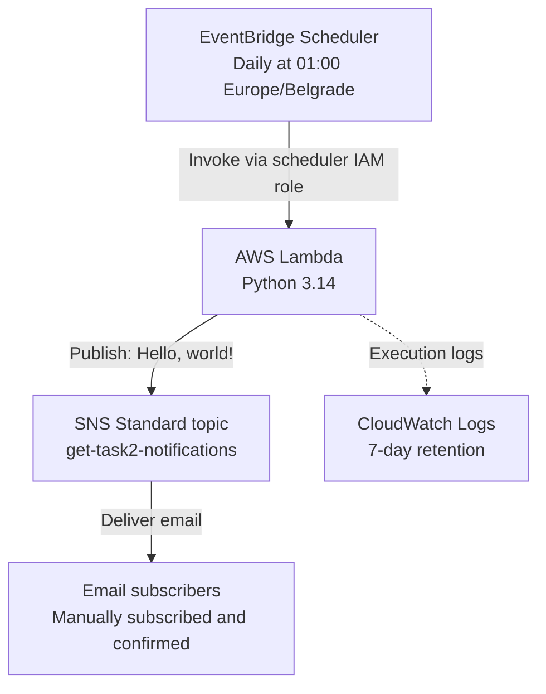

# GET DevOps Task 2

Python Lambda publishes the exact message `Hello, world!` to an SNS Standard topic. EventBridge Scheduler invokes it daily at **01:00 Europe/Belgrade**. Email subscribers are added and confirmed manually, as required by the assignment.

## Architecture



AWS handles scheduling, execution, permissions, retries and email delivery. The function only publishes a message and logs the resulting SNS MessageId. It runs outside a VPC and uses its IAM role for authentication.

## Project layout

| Path | Purpose |
| --- | --- |
| `src/handler.py` | Lambda handler |
| `terraform/` | Lambda, SNS, Scheduler, IAM, logs and mock tests |
| `tests/` | Python/SNS API boundary and packaging tests |
| `scripts/build.py` | Lambda ZIP with hash-locked dependencies |
| `scripts/task2.py` | Live AWS CLI checks, invoke, logs and temporary Scheduler demo |
| `scripts/package.py` | Source-only submission ZIP |
| `docs/DEMO_SR.md` | Serbian demo walkthrough |

## Deploy

Requires Terraform >=1.7 and <2, Python 3.14, AWS CLI v2, GNU Make, Bash and [uv](https://docs.astral.sh/uv/). The Make commands support macOS GNU Make 3.81/Bash 3.2 and Linux GNU Make/Bash. Run commands from the repository root. Use an authorized AWS profile; credentials are not stored in the project.

```bash
export AWS_PROFILE=your-profile
export AWS_REGION=eu-central-1
make help
make identity
make setup
# Set account_id to the intended AWS account.
make init
make check
make plan
make show-plan
make apply
make output
```

`make build` packages Boto3 and all transitive dependencies from `requirements.txt`; it does not rely on the runtime's bundled SDK. The provider version is locked in `terraform/.terraform.lock.hcl`. Local configuration, Terraform state, build artifacts and evidence are ignored by Git and excluded from the submission ZIP. Preserve local state for future updates and teardown.

`make setup` preserves existing local configuration. `make check`, `make test`, `make validate` and plan commands build the Lambda ZIP automatically. `make apply` applies the previously saved `terraform/task2.tfplan` immediately, without another confirmation prompt. Keep its `build/lambda.zip` unchanged between plan and apply; if code or dependencies change, generate and review a fresh plan. Run each stage only after the previous stage succeeds.

## Manual email subscription

1. Open SNS in the deployment region and select `get-task2-notifications`.
2. Choose **Create subscription**, protocol **Email**, and enter the recipient's address.
3. Open the Amazon SNS confirmation email and click **Confirm subscription**.
4. Verify the subscription is confirmed, rather than `PendingConfirmation`.

Neither Terraform nor the Lambda code creates email subscriptions. Email endpoints require a Standard topic. SNS adds its standard email footer; the published message itself is exactly `Hello, world!`. [AWS email subscription guide](https://docs.aws.amazon.com/sns/latest/dg/sns-email-notifications.html)

## Schedule and permissions

- Schedule: `cron(0 1 * * ? *)`, time zone `Europe/Belgrade`, flexible time window `OFF`.
- The time zone follows daylight-saving changes. Scheduler has minute-level precision, so invocation is within 01:00:00–01:00:59 under normal operation; inbox delivery can occur later. [AWS schedule semantics](https://docs.aws.amazon.com/scheduler/latest/UserGuide/schedule-types.html)
- Scheduler assumes a role restricted to this account and schedule group, then invokes only this Lambda.
- Lambda can publish only to this topic and write only to its pre-created CloudWatch log group (7-day retention).
- Scheduler delivery and Lambda asynchronous processing each allow two retries within a five-minute event-age limit. There is one daily scheduled event, but retries and asynchronous delivery can cause duplicate messages; this is not an exactly-once email system. [AWS asynchronous retry behavior](https://docs.aws.amazon.com/lambda/latest/dg/invocation-async-error-handling.html)

## Verify

The following live test publishes a message to every confirmed subscriber:

```bash
make status
make subscriptions
make invoke
make logs SINCE=10m
```

The CLI uses the region/ARNs in Terraform outputs and rejects a profile for a different AWS account. `make invoke` fails if Lambda reports **`FunctionError`**, even with HTTP status 200, or if the payload lacks `message_id` or the exact message. It saves the response and metadata under a new `evidence/invoke-*` directory. `make status` and `make logs` also save evidence; `make logs-follow` streams until Ctrl-C. [AWS invoke response](https://docs.aws.amazon.com/cli/latest/reference/lambda/invoke.html)

`make verify` runs status, invoke and logs in order and **sends a test email**. Check that CloudWatch records `published` and the recipient actually receives `Hello, world!`; SNS accepting a publish does not prove inbox delivery. Logs can take time to appear. Follow [DEMO_SR.md](docs/DEMO_SR.md) for the Scheduler test.

```bash
make demo-schedule DELAY=180
# After the scheduled time, inspect logs and the recipient's inbox.
make logs
make demo-status
```

The demo creates `<schedule_group>-demo` in the existing schedule group, reusing the Lambda and Scheduler role. `DELAY` is 60–3600 seconds; the one-time timestamp uses UTC on both Linux and macOS. It enables automatic deletion after completion and leaves the daily Belgrade schedule unchanged. An existing demo with the same name causes an error; inspect it with `make demo-status`, or cancel it with `make demo-delete`. An absent demo alone does not prove successful delivery. [AWS create-schedule](https://docs.aws.amazon.com/cli/latest/reference/scheduler/create-schedule.html)

```bash
make check
make package
```

`make check` validates and formats-checks Terraform, runs mocked AWS tests and Python regression tests, and checks Python with Ruff. Mock tests do not call AWS or send email. Packaging creates `dist/GET-Task2-Lambda.zip` and a SHA-256 file.

## Make command reference

Run `make` or `make help` to list every command. Neither default command contacts AWS. For checks on a fresh checkout, run `make init-check` before `make check`; provider/package downloads may need internet access, but these checks do not provision AWS resources.

| Workflow | Commands |
| --- | --- |
| Prepare | `make setup`, `make identity`, `make init`, `make build` |
| Local checks | `make init-check`, `make format`, `make validate`, `make test`, `make check` |
| Deploy | `make plan`, `make show-plan`, `make apply` |
| Inspect Terraform | `make output`, `make state`, `make refresh-plan`, `make refresh` |
| Inspect/test AWS | `make status`, `make subscriptions`, `make invoke`, `make verify` |
| Logs | `make logs SINCE=30m`, `make logs-follow` |
| Scheduler demo | `make demo-schedule DELAY=180`, `make demo-status`, `make demo-delete` |
| Submit and clean local artifacts | `make package`, `make clean` |

Override `TERRAFORM` and `PYTHON` with executable names or absolute paths. `PLAN`, `DESTROY_PLAN`, `REFRESH_PLAN`, `PAUSE_PLAN` and `RESUME_PLAN` select saved plan filenames, relative to `terraform/` unless absolute. `make show-plan PLAN=pause.tfplan` displays any selected plan. Keep the filename the same for planning and applying.

`make clean` removes only default ZIPs and plans, preserving state, `.terraform/`, tfvars, evidence and custom filenames. Email subscription/confirmation stays manual. These commands manage the lab in the selected state, not all resources in an AWS account.

## Pause and teardown

Disable the daily schedule while keeping the infrastructure:

```bash
make pause-plan
make show-plan PLAN=pause.tfplan
make pause
```

To resume, run `make resume-plan`, review it with `make show-plan PLAN=resume.tfplan`, then `make resume`. These plans override `schedule_enabled` for that operation; update `terraform/terraform.tfvars` as well if the setting should persist on future ordinary `make plan` runs. Review complete plans because they can include other pending changes. Pausing the daily schedule does not cancel an independent demo or an event already delivered to Lambda.

AWS services are metered; no zero-cost guarantee is assumed. After the exercise, remove any temporary demo schedule **before** Terraform outputs/group are removed, then remove all Terraform-managed lab resources:

```bash
make demo-delete
make destroy-plan
make show-plan PLAN=destroy.tfplan
make destroy
make state
```

Deleting the topic also removes its manual subscriptions. Deleting the log group removes stored logs, so export required evidence first.
